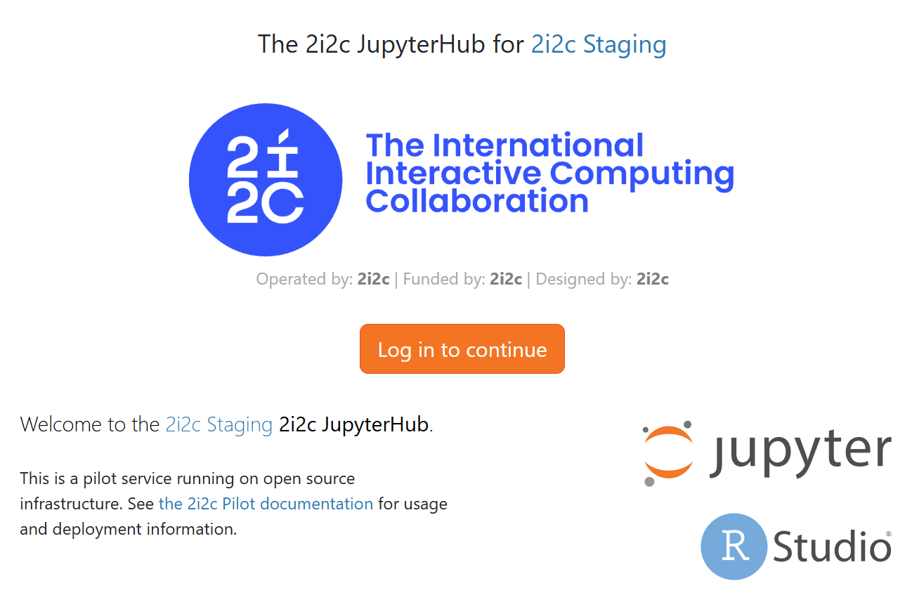

# 2i2c Essential Tier

In 2i2c’s Essential Tier, 2i2c configures and deploys a single JupyterHub on behalf of a community making recommendations that are appropriate for many research and education scenarios. It assumes that there are up to two  ‘Community Representatives’ who are authorized to communicate with 2i2c on behalf of the community.  

*At various points in this procedure, there may be service details or feature options that 2i2c are able to provide but are not being offered within the Essential Tier at this time. In those situations, Advanced Tier or Premium Tier are more appropriate for the community.*

2i2c requires a signed service agreement before deploying infrastructure on behalf of a community.

This process is started as soon as the Opportunity has been marked ‘Closed-Won’ and BD has signed off as ready for deployment. By signing off, BD is asserting

1. This agreement is fully signed and executed by all parties (the community, 2i2c, and CS&S)
2. The signed agreement is uploaded and available in the 2i2c AirTable
3. The metadata in Airtable for the opportunity is verified and consistent with the signed service agreement. In particular, the start date for the opportunity, the end date for the opportunity, the revenue expected from this agreement included estimated cloud costs and MAUs.  
4. CS&S has the required contact information to be able send out invoices.
5. At least one ‘Community Representative’ has been identified as the primary point of contact for the Product and Services Team to communicate with.  Name, GitHub id, and email address for this person must be in the AirTable contacts table.
6. A choice for the community identifier **&lt;community_id>**

*What if there are multiple points of contact within a community and/or the technical leadership and the community champion are represented by three or more individuals? Advanced Tier or Premium Tier.*

Upon hand-off from BD, the following introductory email is sent to the Community Representative:

    Welcome to 2i2c’s Essential Tier.  

    Our infrastructure team will schedule the deployment and rollout of a JupyterHub for your community.

    Our team works on a two week iteration model. Our next iteration period is for &lt;date> to &lt;date> and we commit to having your hub deployed and available by the end of that iteration.

    We will be deploying a JupyterHub on AWS infrastructure in the us-west-2 region.  

    2i2c reserves the right to migrate infrastructure to a different cloud provider. As of June 2025, 2i2c uses AWS to deploy infrastructure under the Essential Tier.  

    When the hub is deployed, the URL will be https://**&lt;community_id>.2i2c.cloud**

    2i2c needs a way to identify who is an authorized user of your hub infrastructure. At the Essential Tier, we can offer any identity provider supported by CILogin which includes GitHub organizations, or Google Workspace based email addresses.

    [ *What choice for authentication can 2i2c make here to enable it to be quick to deploy but changeable if needed?* ] 

    Please review the following information:

    Community Name: &lt;Long name of community>

    Community Identifier: &lt;Community short name>

    Community Technical Lead:

    	Name: &lt;Community Technical Lead name>

    	Email: &lt;Community Technical Lead email address>

    	GitHub Id: &lt;Community Technical Lead GitHub id>

    Community logo image: a URL to an image we can use as a splash image for your JupyterHub page

    Community web page URL: a URL that we can link back to that described your community

    Funded by information (name and URL): (Optional) Organization and URL that the community would like to acknowledge as a funder for this hub.

    [ Implementation Detail : Develop a AirTable form where this information can be captured and updated ]

    If your community would like to configure this page, you may follow the instructions given at [https://github.com/2i2c-org/default-hub-homepage](https://github.com/2i2c-org/default-hub-homepage) and provide the repository and branch you would prefer that we use.

    *What if the community wants to use a customized landing page (not based on the JupyterHub template) or customized domain name? Advanced Tier or Premium Tier.*

    These fields can be changed at any time via a support request made to [support@2i2c.org](mailto:support@2i2c.org) 

    When the hub has been deployed, you will revise a follow up email with further instructions.

    In the meantime, please see our self-service documentation at [https://docs.2i2c.org](https://docs.2i2c.org) and our [Hub Champion Training](https://catalystproject.cloud/hub-champion-training/index.html) information. 2i2c will periodically run this training for new Community Representatives.

    During the service period, please email [support@2i2c.org](mailto:support@2i2c.org) for any infrastructure related issues or configuration requests. We will acknowledge your request and resolve any issues within 3 business days on a best effort basis.

    Peer and community discussion for best practices using a 2i2c maintained JupyterHub can be found at [https://2i2c.discourse.org](https://2i2c.discourse.org)

    Kind regards

    2i2c Product and Services Team

*What if a community needs to use a specific cloud provider? Advanced Tier or Premium Tier.*

2i2c chooses a single word to represent the name of this community in our infrastructure.  This one word will be used as an identifier for the project, billing, cluster, hub, and URL.  

&lt;**community_id>**

2i2c creates a new AWS project called ***&lt;community_id>*** linked to 2i2c AWS billing account by following [https://infrastructure.2i2c.org/hub-deployment-guide/runbooks/phase1/new-aws-account/](https://infrastructure.2i2c.org/hub-deployment-guide/runbooks/phase1/new-aws-account/)

*What if a community wants to use its own billing account? Advanced Tier or Premium Tier.*

At the Essential Tier, 2i2c retains ownership of the billing account to not add the additional step of needing to get access to a community’s billing account to be able to deploy the infrastructure. 

2i2c deploys a Kubernetes cluster following the process documented in [https://infrastructure.2i2c.org/hub-deployment-guide/new-cluster/new-cluster/](https://infrastructure.2i2c.org/hub-deployment-guide/new-cluster/new-cluster/) . This step is covered by [https://infrastructure.2i2c.org/hub-deployment-guide/runbooks/phase2/](https://infrastructure.2i2c.org/hub-deployment-guide/runbooks/phase2/) where the following decisions are made on behalf of the community. 

* Region / Zone of the cluster: **AWS / us-west-2**
* Name of cluster: ***&lt;community_id>***
* Is GPU required?: **No**

*What if a community needs something different from these choices? Advanced Tier or Premium Tier.*

2i2c deploys a staging and production JupyterHub in this new cluster by following [https://infrastructure.2i2c.org/hub-deployment-guide/runbooks/phase3/initial-hub-setup/](https://infrastructure.2i2c.org/hub-deployment-guide/runbooks/phase3/initial-hub-setup/)

Choices made by 2i2c on behalf of the community at the Essential Tier:

Name of the hub

* Will Dask gateway be required?: **No**
* Authentication mechanism: **CILogon**
* Splash image: **2i2c Logo or url provided by the community**
* URL of the community’s webpage: None or url provided by the community.
* Funded by information (name and URL): If provided by community
* List of admin users: **Community Representatives**

Use jupyterhub-fancy-profiles and configure the following images

* JupyterDocker stacks scipy
* JupyterDocker stacks datascience
* Pangeo image
* Rocker RStudio

Bring your own image

Build your own image

* Dynamic image building

Under the Essential Tier, we do not expose the node sizes we provide to communities.  A community can select the configuration (num CPUs, RAM size) that each instance uses. 

2i2c will maintain the node groups to optimize the number of instances to fit on each node based on the expected usage of the community.

Once the hub has been deployed, notify the Community Representatives with the following email:

    Your 2i2c JupyterHub has been deployed at https://&lt;community_id>.2i2c.cloud . As a Community Representatives, the following accounts 

* Name 1, Email 1, GitHub 1
* Name 2, Email 2, GitHub 2

    have been configured as administrator accounts. Please verify that you are able to log in your your {authentication method for this hub} credentials.  If you are unable to log in, please send an email to [support@2i2c.org](mailto:support@2i2c.org) 

    Your hub has been pre-configured with a number of commonly used images

    Use jupyterhub-fancy-profiles and configure the following images

* JupyterDocker stacks scipy
* JupyterDocker stacks datascience
* Pangeo image
* Rocker RStudio

    Bring your own image

    See our [User environment and interface — Hub Service Guide](https://docs.2i2c.org/admin/howto/environment/) documentation for recommendations on creating and maintain your own images. At the Essential Tier, 2i2c is not able to provide direct technical support on images but we encourage you to post in [2i2c.discourse.org](2i2c.discourse.org) to share your configuration. It is likely there is another community that has encountered a similar issue that you can adapt for your community.

    We have preconfigured each user session to use a maximum of 4 GB ram and up to 4 CPUs at one time.  We can adjust how much RAM each user instance consumes. Please contact [support@2i2c.org](mailto:support@2i2c.org) if you need to change this amount.  We recommend using the infrastructure and running your intended workflow and measuring how much RAM is needed. 2i2c has learned that RAM, not the number of CPUs, is typically the limiting factor for many workflows used by our Essential Tier communities.  The trade off is more RAM allocated per user, even if it is not used, increases the cloud usage cost.  

    As administrators, community representatives, can log in to [https://grafana](https://grafana).&lt;communiy_id>.2i2c.cloud and observe the historical usage.  

    Cloud usage costs are the responsibility of the community and 2i2c will pass these costs on to you on a monthly basis.  We will alert you if your usage has increased more than 20% from the previous month to ensure you are staying within your intended cloud usage budget.

    File storage.  Each user has been assigned a quota on their home directories of 10GB.  Files storage incurs a cost even if no user instances are being started. Please periodically review Grafana homedirs table to see who is using space.  

    Shared files.  We have configured a special directory shared that is read only. The administrators have special access to shared_readwrite which allows files that need to be read by multiple users to be uploaded.  When doing computation in the cloud, please also consider object storage like S3 buckets as an alternative to block file storage. (Reference to …?)

    Best wishes to your community in using your 2i2c managed Hub. The 2i2c Product and Services infrastructure team can be reached at [support@2i2c.org](mailto:support@2i2c.org) for additional guidance and configuration request which we will try and resolve on a best effort basis (usually less than 3 business days).  You can also reach out to 2i2c communities on [https://2i2c.discourse.org](https://2i2c.discourse.org) to connect with our global network of research and learning communities.

    Kind regards,

    2i2c

Once deployed, this cluster and its hub come under the active management of 2i2c’s Product and Service Team. 2i2c is responsible for

* Upgrading the version of JupyterHub as released
* Upgrading the version of AWS EKS
* Deploying any security patches as needed
* Monitoring the usage and costs incurred by all clusters and communicating promptly with communities when costs have exceeded or are projected to exceed historical norms.

2i2c is not responsible for

* Direct support or training of the users of community hubs.
* The configuration of community-maintained images. 2i2c is able to provide limited support on the images maintained through the JupyterHub Docker Stacks project.
* Creating or managing S3 storage although a community is welcome to create and use these assets under their AWS own billing account.

Communities are encouraged to either provide direct access to their infrastructure or use nbgitpuller style links to share content with their users.

## At the end of an engagement

About 60 days before the end of an engagement, BD will contact the community to begin the process of renewal.  If a renewal is not agreed to, PS will begin an orderly decommissioning of the infrastructure:

1. Hub infrastructure and clusters are decommissioned at the end of non-renewed engagement.
2. The community is notified 2 weeks prior to the end of the engagement, at the end of the engagement. 

*Should Dynamic Image Building be a feature in the Essential Tier?  No, but see below:*

# 2i2c Essential Tier with Anonymous Access

We could offer variation of the Essential Tier with Anonymous Access. Deploy as a BinderHub-UI (no authentication, no persistent storage).  

Deploying infrastructure breaks the assumption that there is a community of users who are sharing. Instead, this is a mechanism for a small group of authors to share outward to an unlimited number of readers.  This would also allow for dynamic image building.

We should brand this as something distinct from 2i2c Essential Tier.  

Alternatively, we could offer this BinderHub-UI service as a public facing service with GitHub authentication. This would allow Essential Tier communities to have access to a version of dynamic image building without having to manage it for distinct communities.
